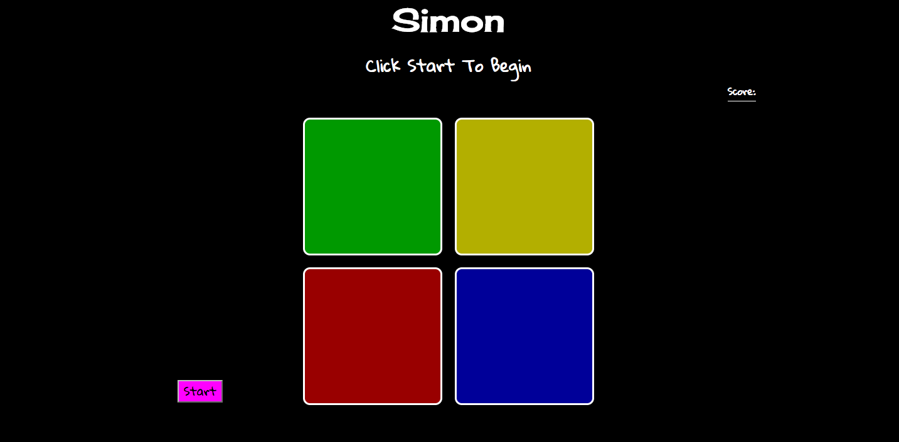

# Simon Game

## Techologies Used

HTML, CSS, JavaScript, React

## Description

I built a Simon game using vanilla HTML and JavaScript a while ago, and wanted to try to refactor it using React. Coding it in React made it much easier to configure all the different ways the colored squares behave. 

## Author

Mimi Klein

## Future Additions

I'd like to add sound effects for when the colors are clicked and light up. I'd also like to get the game to speed up as it goes on to make the game more challenging. 